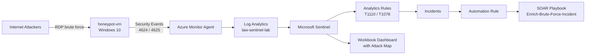

# Cloud Honeypot SOC Lab with Microsoft Sentinel

A fully functional cloud Security Operations Center built from scratch in Microsoft Azure. An intentionally exposed Windows honeypot collects live internet attacks, streams its security logs into Microsoft Sentinel, and feeds a set of custom detection rules, an automated response pipeline, and a live attack dashboard.

This project implements the complete detection and response loop (detect, alert, generate an incident, and respond automatically), with every detection mapped to MITRE ATT&CK.

## Overview

I deployed a Windows virtual machine with its firewall disabled and a wide open network security group so that real attackers on the internet would find it and attack it. Every failed and successful logon is forwarded into a Log Analytics workspace and analyzed in Microsoft Sentinel.

Within minutes of going live the honeypot began drawing automated brute force traffic from around the world. Over the collection window it logged more than 11,000 failed RDP logon attempts from sources in Russia, Brazil, Germany, the United Kingdom, Taiwan, the Netherlands, Morocco, France, and Belgium.

On top of that raw data I built three scheduled detection rules, a SOAR automation pipeline that enriches and triages incidents with no human input, and an interactive workbook with a global attack map.

## Architecture



Flow in plain terms: attackers hit the exposed VM over RDP, the Azure Monitor Agent forwards Windows security events into Log Analytics, Microsoft Sentinel reads those logs, scheduled analytics rules turn suspicious patterns into incidents, an automation rule hands each brute force incident to a SOAR playbook that enriches and triages it, and a workbook visualizes the whole attack surface.

## Tech Stack

Microsoft Azure, Microsoft Sentinel (SIEM and SOAR), Log Analytics, Kusto Query Language (KQL), Azure Monitor Agent, Azure Logic Apps, Azure RBAC and managed identities, MITRE ATT&CK, Windows Security Event logging.

## Skills Demonstrated

SIEM administration, detection engineering, KQL query writing, security automation (SOAR), incident response, threat hunting, identity and access management (RBAC and managed identity configuration), MITRE ATT&CK mapping, and cloud cost management.

## Environment

| Resource | Value |
| --- | --- |
| Resource group | rg-sentinel-soc-lab |
| Honeypot VM | honeypot-vm (Windows 10 Enterprise 22H2) |
| Region | West US 2 |
| Log Analytics workspace | law-sentinel-lab |
| Data connector | Windows Security Events via AMA |
| Data collection rule | dcr-windows (All Security Events) |

## Build Phases

1. **Foundation.** Created the Azure subscription, resource group, and a monthly budget with cost alerts.
2. **Honeypot.** Deployed a Windows 10 VM, opened the network security group to all inbound traffic, and disabled the internal Windows firewall so the machine would attract attackers.
3. **Logging pipeline.** Created the Log Analytics workspace, enabled Microsoft Sentinel on top of it, and connected Windows Security Events through the Azure Monitor Agent with a data collection rule scoped to the honeypot.
4. **Analysis.** Wrote KQL to count failed logons, identify the most aggressive source IPs, enrich attacker IPs with geolocation, and confirm whether any remote logon ever succeeded.
5. **Detection engineering.** Authored three scheduled analytics rules with entity mapping and MITRE ATT&CK tags.
6. **Automation.** Built a SOAR playbook and an automation rule that auto-enriches and triages brute force incidents.
7. **Visualization.** Built a workbook with a global attack map, key metrics, and breakdowns by country, username, and source IP.
8. **Validation.** Ran a controlled self test to confirm the breach detection fires correctly, and verified no real attacker ever compromised the host.

## Detection Rules

| Rule | What it catches | MITRE ATT&CK | Severity |
| --- | --- | --- | --- |
| Brute Force, Failed RDP Logins | A single IP with 10 or more failed logons | T1110 Brute Force (Credential Access) | Medium |
| Username Spraying Against RDP | A single IP attempting 5 or more distinct usernames | T1110.003 Password Spraying (Credential Access) | Medium |
| Successful Login After Brute Force | A remote success from an IP that previously failed many times (a possible breach) | T1078 Valid Accounts (Initial Access) | High |

### Rule 1: Brute Force, Failed RDP Logins

Counts failed logons (Event ID 4625) per source IP and flags any that crossed a threshold of 10. Each entity (IP and host) is mapped so the resulting incident is fully investigable.

```kql
SecurityEvent
| where EventID == 4625
| summarize FailedAttempts = count() by IpAddress, Computer
| where FailedAttempts >= 10
```

### Rule 2: Successful Login After Brute Force

Compares failed and successful logons from the same external IP. A source with many failures and at least one success is the fingerprint of a brute force attack that finally broke through. The filter on IpAddress removes local and system logons that carry a blank address.

```kql
SecurityEvent
| where EventID in (4624, 4625)
| where IpAddress != "-" and isnotempty(IpAddress)
| summarize FailedAttempts = countif(EventID == 4625), SuccessfulLogins = countif(EventID == 4624) by IpAddress, Computer, Account
| where FailedAttempts >= 5 and SuccessfulLogins >= 1
| sort by FailedAttempts desc
```

This rule is designed to stay silent in normal operation. On this honeypot it never fired from a real attacker, which is the correct result and proof the host was never compromised.

### Rule 3: Username Spraying Against RDP

Counts how many distinct usernames a single IP targets. Spreading attempts across many accounts is the signature of password spraying. The query also collects the actual usernames tried so an analyst can see exactly what was attempted.

```kql
SecurityEvent
| where EventID == 4625
| where IpAddress != "-" and isnotempty(IpAddress)
| summarize DistinctUsernames = dcount(Account), TotalAttempts = count(), UsernamesTried = make_set(Account, 20) by IpAddress, Computer
| where DistinctUsernames >= 5
| sort by DistinctUsernames desc
```

## SOAR Automation Pipeline

The detection rules generate incidents, but a real SOC does not stop there. I built an automated response so that triage groundwork is done before a human ever looks at an incident.

**Playbook (Enrich-Brute-Force-Incident).** An Azure Logic App that, when triggered, posts an enrichment comment to the incident with guidance for the analyst and updates the incident status to Active. It authenticates using a system assigned managed identity that was granted the Microsoft Sentinel Responder role, following least privilege.

**Automation rule (Run Enrich Playbook on Brute Force).** Watches for new incidents, checks whether they came from the brute force rule, and if so runs the playbook automatically.

End to end, the loop runs with zero human input: an attack generates failed logons, the analytics rule files an incident, the automation rule catches it, and the playbook enriches and triages it.

A key part of this work was configuring Azure RBAC correctly. The pipeline initially failed because the components lacked permissions, which I diagnosed and resolved with two scoped role assignments (described in Lessons Learned).

## Attack Dashboard

A Microsoft Sentinel workbook visualizes the live attack surface:

- A global map of attacker source IPs sized by attack volume
- Key metrics for total attacks, unique source IPs, and countries
- A timeline of attack volume over time
- Top attacker countries
- Most targeted usernames
- Top attacker source IPs

Geolocation was done natively with the built in `geo_info_from_ip_address()` KQL function rather than the older approach of a PowerShell script calling an external geolocation API.

```kql
SecurityEvent
| where EventID == 4625
| summarize Attempts = count() by IpAddress
| extend GeoInfo = geo_info_from_ip_address(IpAddress)
| extend Country = tostring(GeoInfo.country), City = tostring(GeoInfo.city), Latitude = todouble(GeoInfo.latitude), Longitude = todouble(GeoInfo.longitude)
| project IpAddress, Attempts, Country, City, Latitude, Longitude
| sort by Attempts desc
```

## Threat Findings

Observations from the collected data:

- More than 11,000 failed RDP logons over the collection window.
- Attack traffic is highly bursty. A single source can generate thousands of attempts in one hour and then go quiet.
- The most targeted usernames were predictable administrative names: ADMIN, ADMINISTRATOR, OPERATOR, ROOT, USER, MANAGER, and SERVER, including localized variants such as ADMINISTRATEUR (French), ADMINISTRADOR (Spanish), and the Cyrillic АДМИНИСТРАТОР. This is a clear sign of globally distributed automated bots.
- A small number of source IPs accounted for the majority of traffic, consistent with attacks originating from hosting providers and botnets.
- Mapped to MITRE ATT&CK, the activity is T1110 Brute Force and T1110.003 Password Spraying, with T1078 Valid Accounts as the compromise condition that was watched for and never observed.

## Detection Validation

To confirm the breach detection works without exposing the host to a real compromise, I ran a controlled test. From a single controlled source IP (through a VPN) I generated several failed RDP logons and then logged in successfully with the correct credentials. This produced the exact pattern Rule 2 looks for (multiple failures followed by a success from one IP), and the rule generated a High severity incident as designed.

I then ran a compromise check that excluded the controlled tester IP and confirmed there were zero successful remote logons from any other source. This validated both that the detection fires correctly and that no real attacker ever accessed the machine.

```kql
SecurityEvent
| where EventID in (4624,4625)
| where IpAddress != "-"
| summarize Failed = countif(EventID==4625), Success = countif(EventID==4624) by IpAddress
| where Failed >= 5 and Success >= 1
```

## Lessons Learned

- **Compute quota wall.** The free trial subscription had a B series vCPU quota of zero, so no low cost VM could be deployed. I upgraded to Pay-As-You-Go, which allows quota requests, and after working through regional capacity limits I deployed in West US 2.
- **Native geolocation.** Instead of the common tutorial approach of a PowerShell script and an external geolocation API, I used the built in `geo_info_from_ip_address()` function, which is simpler to maintain and requires no third party dependency.
- **RBAC troubleshooting.** The SOAR pipeline failed twice on permissions. The automation rule needed the Microsoft Sentinel Automation Contributor role to trigger the playbook, and the playbook's managed identity needed the Microsoft Sentinel Responder role to write back to incidents. I diagnosed the second failure (an HTTP 403 Forbidden) by reading the Logic App run history raw output, then resolved it with a scoped role assignment. This is textbook least privilege identity and access management.
- **Alert tuning.** Because the honeypot is attacked continuously, the brute force rule generates an incident roughly every hour. In a production SOC this would be tuned with higher thresholds and alert grouping to reduce analyst fatigue, which is an important detection engineering consideration.

## Repository Structure

```
sentinel-soc-lab/
  README.md
  queries.md          All KQL used in the project
  screenshots/        Evidence and dashboard images
```

## Screenshots

Add the following images to a `screenshots/` folder and reference them here:

- Attack dashboard with the global map
- The three analytics rules, all enabled
- Brute force incidents queue
- A successful SOAR playbook run
- An auto enriched and triaged incident
- The controlled validation query result
- The compromise check result (no external successful logons)
- The MITRE ATT&CK coverage view

## Future Work

- Connect Microsoft Entra ID sign in logs and add identity based detections such as repeated failed sign ins and impossible travel.
- Pursue the Microsoft SC-200 Security Operations Analyst certification, which maps directly to this work.
- Extend collection over several weeks and publish a longer threat analysis report on attacker trends.
