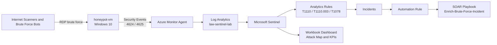

# Microsoft Sentinel Cloud Honeypot SOC Lab

A cloud-based SOC lab built from scratch in Microsoft Azure. An intentionally exposed Windows honeypot collected live internet scanning and RDP brute force activity, streamed Windows security logs into Microsoft Sentinel, and fed custom detection rules, SOAR automation, and a live attack dashboard.

This project demonstrates the full detection and response workflow: collect logs, analyze activity with KQL, generate alerts and incidents, map detections to MITRE ATT&CK, and automate incident enrichment.

> This lab was built in an isolated Azure resource group for educational and portfolio purposes. No production systems or personal devices were exposed.

## Project Status

Core lab complete. Windows honeypot logging, Microsoft Sentinel detections, SOAR automation, workbook dashboard, MITRE mapping, and controlled validation are complete. Microsoft Entra ID diagnostic export was also configured as an optional identity-monitoring add-on, but identity log ingestion was not required for the core honeypot detection workflow.

## Overview

I deployed a Windows virtual machine as a controlled honeypot with RDP exposed to the public internet. Every failed and successful logon was forwarded into a Log Analytics workspace and analyzed in Microsoft Sentinel.

Over the collection window, the honeypot logged more than **77,000 failed RDP logon attempts** from sources around the world. The highest-volume country was Romania, followed by Russia, India, the United Kingdom, Taiwan, Brazil, the United States, Germany, Colombia, and Vietnam.

On top of that raw telemetry, I built three scheduled analytics rules, a SOAR automation pipeline, and an interactive workbook dashboard with a global attack map, country breakdowns, targeted usernames, top source IPs, and attack volume over time.

## Architecture



Flow in plain terms: internet scanners hit the exposed VM over RDP, the Azure Monitor Agent forwards Windows security events into Log Analytics, Microsoft Sentinel reads those logs, scheduled analytics rules turn suspicious patterns into alerts and incidents, an automation rule triggers a SOAR playbook for enrichment, and a workbook visualizes the attack activity.

## Tech Stack

Microsoft Azure, Microsoft Sentinel, Log Analytics, Kusto Query Language (KQL), Azure Monitor Agent, Azure Logic Apps, Azure RBAC, managed identities, MITRE ATT&CK, and Windows Security Event logging.

## Skills Demonstrated

- SIEM administration
- KQL query writing
- Detection engineering
- SOAR automation
- Incident response workflow
- Threat hunting
- MITRE ATT&CK mapping
- Azure RBAC and managed identity troubleshooting
- Cloud security monitoring
- Cloud cost management

## Environment

| Resource | Value |
| --- | --- |
| Resource group | `rg-sentinel-soc-lab` |
| Honeypot VM | `honeypot-vm` |
| Operating system | Windows 10 Enterprise 22H2 |
| Region | West US 2 |
| Log Analytics workspace | `law-sentinel-lab` |
| Data connector | Windows Security Events via AMA |
| Data collection rule | `dcr-windows` |
| Main event IDs | `4625` failed logon, `4624` successful logon |

## Build Phases

1. **Foundation.** Created the Azure subscription, resource group, and cost controls.
2. **Honeypot.** Deployed a Windows VM and exposed RDP in a controlled lab environment to attract public internet login attempts.
3. **Logging pipeline.** Created a Log Analytics workspace, enabled Microsoft Sentinel, and connected Windows Security Events through Azure Monitor Agent.
4. **Analysis.** Wrote KQL to count failed logons, identify top source IPs, enrich attacker IPs with geolocation, and check whether any remote logon succeeded.
5. **Detection engineering.** Created three scheduled analytics rules with MITRE ATT&CK mappings.
6. **Automation.** Built a SOAR playbook and automation rule to enrich and triage brute force incidents.
7. **Visualization.** Built a workbook dashboard with a global map, KPIs, timeline, countries, usernames, and source IPs.
8. **Validation.** Ran a controlled RDP test to confirm the success-after-failures detection logic, then verified that no real attacker successfully logged into the host.

## Detection Rules

| Rule | What it catches | MITRE ATT&CK | Severity |
| --- | --- | --- | --- |
| Brute Force - Failed RDP Logins | A single IP with 10 or more failed logons | T1110 Brute Force, Credential Access | Medium |
| Username Spraying Against RDP | A single IP attempting 5 or more distinct usernames | T1110.003 Password Spraying, Credential Access | Medium |
| Successful Login After Brute Force | A source IP with multiple failures and at least one later success | T1078 Valid Accounts, Initial Access | High |

### Rule 1: Brute Force - Failed RDP Logins

Counts failed logons, Event ID `4625`, per source IP and host. The rule creates an incident when one source crosses the threshold.

```kql
SecurityEvent
| where EventID == 4625
| where IpAddress != "-" and isnotempty(IpAddress)
| summarize FailedAttempts = count() by IpAddress, Computer
| where FailedAttempts >= 10
```

Entity mapping:

- IP: `IpAddress`
- Host: `Computer`

### Rule 2: Successful Login After Brute Force

Detects the compromise pattern of repeated failed logons followed by at least one successful logon from the same source IP to the same host. The final version groups by `IpAddress` and `Computer`, while preserving account names in `AccountsSeen`, because Windows can log failed and successful RDP events under different account formats.

```kql
SecurityEvent
| where EventID in (4624, 4625)
| where IpAddress != "-" and isnotempty(IpAddress)
| summarize FailedAttempts = countif(EventID == 4625), SuccessfulLogins = countif(EventID == 4624), AccountsSeen = make_set(Account, 20) by IpAddress, Computer
| where FailedAttempts >= 5 and SuccessfulLogins >= 1
| sort by FailedAttempts desc
```

Entity mapping:

- IP: `IpAddress`
- Host: `Computer`

This rule is intentionally high severity because it represents a possible successful compromise after brute force activity. In the real attack data, this condition was not observed from external attacker IPs.

### Rule 3: Username Spraying Against RDP

Counts how many distinct usernames a single IP targets. Trying many usernames from one source is consistent with password spraying or automated credential attacks.

```kql
SecurityEvent
| where EventID == 4625
| where IpAddress != "-" and isnotempty(IpAddress)
| summarize DistinctUsernames = dcount(Account), TotalAttempts = count(), UsernamesTried = make_set(Account, 20) by IpAddress, Computer
| where DistinctUsernames >= 5
| sort by DistinctUsernames desc
```

Entity mapping:

- IP: `IpAddress`
- Host: `Computer`

## SOAR Automation Pipeline

The detection rules generate incidents, but a real SOC workflow should not stop at alert creation. I built an automated response pipeline so brute force incidents receive enrichment and triage guidance without manual action.

**Playbook:** `Enrich-Brute-Force-Incident`

An Azure Logic App that runs from Microsoft Sentinel and adds investigation guidance to brute force incidents. The playbook uses a managed identity and scoped RBAC permissions.

**Automation rule:** `Run Enrich Playbook on Brute Force`

A Sentinel automation rule that watches for brute force incidents and triggers the playbook automatically.

The playbook run history showed repeated successful executions with no failures during the final collection window, proving the SOAR workflow ran reliably.

## Attack Dashboard

The Microsoft Sentinel workbook visualizes the live attack surface with:

- Total failed RDP login attempts
- Global map of attacker source IPs
- Attack volume over time
- Top attacker countries
- Most targeted usernames
- Top attacker source IPs

All dashboard tiles were set to the same time range for consistency. The controlled tester IPs were excluded from attacker-facing dashboard views so the dashboard reflects external attack activity only.

Geolocation was done natively with the built-in `geo_info_from_ip_address()` KQL function.

```kql
SecurityEvent
| where EventID == 4625
| where IpAddress != "-" and isnotempty(IpAddress)
| summarize Attempts = count() by IpAddress
| extend GeoInfo = geo_info_from_ip_address(IpAddress)
| extend Country = tostring(GeoInfo.country), City = tostring(GeoInfo.city), Latitude = todouble(GeoInfo.latitude), Longitude = todouble(GeoInfo.longitude)
| project IpAddress, Attempts, Country, City, Latitude, Longitude
| sort by Attempts desc
```

## Threat Findings

Observations from the collected data:

- The honeypot recorded more than **77,000 failed RDP logon attempts**.
- Romania was the highest-volume source country, driven heavily by one high-volume source IP that generated more than **46,000 attempts**.
- Other major source countries included Russia, India, the United Kingdom, Taiwan, Brazil, the United States, Germany, Colombia, and Vietnam.
- Attack traffic was bursty. Some sources generated thousands of attempts in short windows and then stopped.
- The most targeted usernames were predictable administrative or cloud-related names such as `HONEYPOT\Administrator`, `Administrator`, `ADMINISTRADOR`, `ADMIN`, `admin`, `USER`, and `AZUREUSER`.
- The presence of Azure-style usernames such as `AZUREUSER` suggests bots were attempting common cloud VM credential patterns.
- The activity maps primarily to MITRE ATT&CK `T1110` Brute Force and `T1110.003` Password Spraying.
- `T1078` Valid Accounts was monitored as the possible compromise condition, but no real attacker success was observed.

## Detection Validation

To validate the high severity breach detection without letting a real attacker in, I ran a controlled RDP test from my own tester IP. I intentionally generated multiple failed RDP logons, then logged in successfully with the correct credential.

The validation query showed the expected pattern:

- Multiple failed logons
- Multiple successful logon events
- Same source IP
- Same target host, `honeypot-vm`

I then ran a compromise check that excluded my controlled tester IPs. It returned no external successful logons, which means the logs did not show evidence of a real attacker successfully accessing the VM.

Controlled validation query:

```kql
SecurityEvent
| where EventID in (4624,4625)
| where IpAddress != "-" and isnotempty(IpAddress)
| summarize Failed=countif(EventID==4625), Success=countif(EventID==4624) by IpAddress
| where Failed >= 5 and Success >= 1
```

Compromise check query:

```kql
let MyIPs = dynamic(["TESTER_IP_1", "TESTER_IP_2"]);
SecurityEvent
| where EventID == 4624
| where IpAddress != "-" and isnotempty(IpAddress)
| where IpAddress !in (MyIPs)
| project TimeGenerated, Account, IpAddress, Computer, LogonType
| sort by TimeGenerated desc
```

For public screenshots, tester IP values should be blurred or replaced with placeholders.

## Optional: Microsoft Entra ID Identity Monitoring

As an optional identity-security extension, I configured Microsoft Entra ID diagnostic settings to forward identity logs into the same Log Analytics workspace.

Diagnostic setting:

`send-to-sentinel`

Forwarded categories included:

- `AuditLogs`
- `SignInLogs`
- `NonInteractiveUserSignInLogs`
- `ServicePrincipalSignInLogs`
- `RiskyUsers`
- `UserRiskEvents`
- `RiskyServicePrincipals`

This expands the lab from host-based monitoring into identity monitoring. If sign-in logs populate, the next detection would be repeated failed Entra ID sign-ins mapped to MITRE `T1110`.

## Screenshots

| Screenshot | Description |
| --- | --- |
| `screenshots/01a-dashboard.png` | Dashboard timeline and top attacker countries |
| `screenshots/01b-dashboard.png` | Global attack map and total failed login attempts |
| `screenshots/01c-dashboard.png` | Targeted usernames and top attacker IPs |
| `screenshots/02-detection-rules.png` | Three enabled analytics rules with MITRE mappings |
| `screenshots/03a-incidents-queue.png` | Incident queue showing active detection volume |
| `screenshots/03b-incidents-queue.png` | Incident queue showing both brute force and username spraying detections |
| `screenshots/04-soar-runs.png` | SOAR playbook run history with successful executions |
| `screenshots/05a-mitre-brute-force.png` | MITRE ATT&CK coverage for Brute Force |
| `screenshots/05b-mitre-valid-accounts.png` | MITRE ATT&CK coverage for Valid Accounts |
| `screenshots/06-controlled-validation.png` | Controlled failed-then-successful RDP validation |
| `screenshots/07-compromise-check.png` | Compromise check showing no external successful logons |

> Note: controlled tester IP addresses are blurred in public screenshots.

## Repository Structure

```text
sentinel-soc-lab/
  README.md
  queries.md
  incident-writeup.md
  entra-identity-detection.md
  screenshots/
```

## Lessons Learned

- **Cloud quota and region limits matter.** The Azure free trial had quota limitations, so VM deployment required working through subscription and regional availability constraints.
- **Native geolocation is cleaner.** Using `geo_info_from_ip_address()` avoided maintaining an external GeoIP spreadsheet or API script.
- **Detection grouping matters.** The successful-login-after-brute-force rule originally grouped by account, but Windows logged account names in multiple formats. Grouping by IP and host while preserving accounts in `AccountsSeen` made the rule more reliable.
- **SOAR depends on RBAC.** The automation pipeline required correct Sentinel and Logic App permissions. Troubleshooting RBAC and managed identity access was a realistic part of the build.
- **Dashboards need consistent time ranges.** Setting all tiles to the same time range made totals, country counts, and timelines align cleanly.
- **Not every detection should be noisy.** The brute force and username spraying rules generated frequent incidents, while the success-after-failures rule was designed to stay quiet unless a possible compromise occurred.

## Future Work

- Add saved Microsoft Sentinel hunting queries for repeated attacker IPs, targeted usernames, and successful remote logons.
- Expand Entra ID identity detections if sign-in logs populate consistently.
- Add longer-term trend analysis after multiple weeks of collection.
- Continue studying for Microsoft SC-200 Security Operations Analyst.
